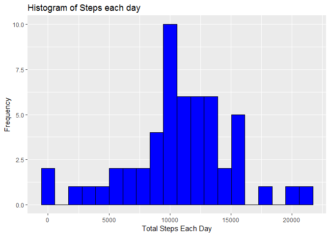
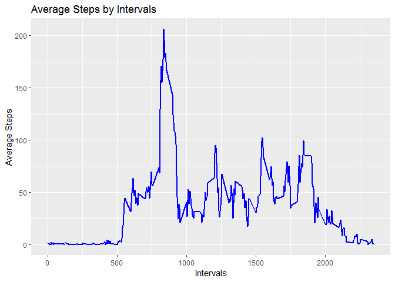
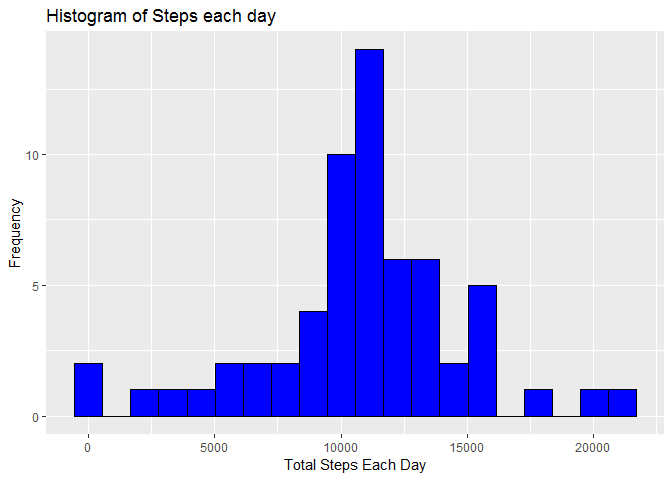
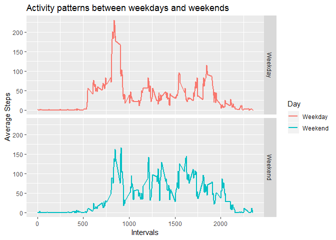

## Loading and preprocessing the data

1. First I loaded all the needed packages


```r
library(readr)
library(dplyr)
library(lubridate)
library(ggplot2)
library(tidyverse)
```


2. Activity file was downloaded from the given [URL](https://d396qusza40orc.cloudfront.net/repdata%2Fdata%2Factivity.zip) and then `read_csv()` function was used to read the CSV file. 

```r
activity <- read_csv("./data/activity.csv")
```


## What is mean total number of steps taken per day?

1. Calculate total steps per day, we can ignore NA values for this step.


```r
dailySteps <- activity %>%
        drop_na() %>%
        group_by(date) %>%
        summarise(totalSteps = sum(steps, na.rm = TRUE))
dailySteps
```

```
## # A tibble: 53 x 2
##    date       totalSteps
##    <date>          <int>
##  1 2012-10-02        126
##  2 2012-10-03      11352
##  3 2012-10-04      12116
##  4 2012-10-05      13294
##  5 2012-10-06      15420
##  6 2012-10-07      11015
##  7 2012-10-09      12811
##  8 2012-10-10       9900
##  9 2012-10-11      10304
## 10 2012-10-12      17382
## # ... with 43 more rows
```


2. Next we used ggplot to create histogram of total daily steps


```r
ggplot(data = dailySteps, aes(x=totalSteps)) +
        geom_histogram(col = "black", fill = "blue", bins = 20) +
        labs(title="Histogram of Steps each day", y ="Frequency", x = "Total Steps Each Day")
```

<!-- -->

3. Next I calculated Mean and median of the total number of steps taken per day


```r
mean(dailySteps$totalSteps)
```

```
## [1] 10766.19
```

```r
median(dailySteps$totalSteps)
```

```
## [1] 10765
```

## What is the average daily activity pattern?
1. Calculate the average number of steps taken, averaged across all days for all intervals

```r
stepsByInterval <- activity %>%
        group_by(interval) %>%
        summarise(averageSteps = mean(steps, na.rm = TRUE)) 
```


2. Make a plot with intervals on x-axis and average steps taken on the y-axis


```r
ggplot(data = stepsByInterval, aes(x=interval, y = averageSteps)) +
        geom_line(col = "blue", size = 1) + 
        labs(title="Average Steps by Intervals", y ="Average Steps", x = "Intervals")
```

<!-- -->


3. Get the interval which has maximum number of average steps across all days


```r
stepsByInterval %>%
        slice(which.max(averageSteps))
```

```
## # A tibble: 1 x 2
##   interval averageSteps
##      <int>        <dbl>
## 1      835         206.
```


## Imputing missing values

1. Calculate the total number of rows with missing values in the dataset


```r
activity %>% 
        filter(!complete.cases(.)) %>%
        summarise(n())
```

```
## # A tibble: 1 x 1
##   `n()`
##   <int>
## 1  2304
```


2. We can use average steps for an interval from all days to fill in the missing values in `steps` column. We can use `stepsByInterval` dataframe that we crated in previous steps to get the average steps for each interval. 
By using `inner_join` function, I joined `stepsByInterval` with `Activity` dataframe by `interval` column. Now activity dataframe has `averageSteps` column.  


```r
activity <- inner_join(activity, stepsByInterval, by = "interval")
```

3. We then used `averageSteps` column to fill value for any missing data in steps column.


```r
activity_Imputed <- activity %>%
        mutate(steps = if_else(is.na(steps), averageSteps, as.double(steps)))
```


4. Using the imputed dataframe, I created histogram of total stpes taken each day. Also, calculated the mean and median steps for all days.   


```r
dailySteps_Imputed <- activity_Imputed %>%
        group_by(date) %>%
        summarise(totalSteps = sum(steps, na.rm = TRUE))


ggplot(data = dailySteps_Imputed, aes(x=totalSteps)) +
        geom_histogram(col = "black", fill = "blue", bins = 20) +
        labs(title="Histogram of Steps each day", y ="Frequency", x = "Total Steps Each Day")
```

<!-- -->

We can see that both mean and median values are unchanged by imputing NA values for steps column.


```r
mean(dailySteps_Imputed$totalSteps)
```

```
## [1] 10766.19
```

```r
median(dailySteps_Imputed$totalSteps)
```

```
## [1] 10766.19
```

## Are there differences in activity patterns between weekdays and weekends?

1. Created a new factor variable in the dataset `Day` with two levels - "weekday" and "weekend" indicating whether a given date is a weekday or weekend day.


```r
activity_Imputed <- activity_Imputed %>%
        mutate(Day = ifelse(wday(date) == 7 | wday(date) == 1 , "Weekend", "Weekday"))

activity_Imputed$Day <- factor(activity_Imputed$Day)
```


2. A panel plot containing the 5-minute interval (x-axis) and the average number of steps taken, averaged across all weekday days or weekend days (y-axis).


```r
stepsByIntervalByDay <- activity_Imputed %>% 
        group_by(interval, Day) %>%
        summarise( meanSteps = mean(steps))


ggplot(data = stepsByIntervalByDay, aes(x = interval, y = meanSteps, col = Day)) +
        geom_line(size = 1) + 
        facet_grid(rows = vars(Day)) +
        labs(title="Activity patterns between weekdays and weekends", x ="Intervals", y = "Average Steps")
```

<!-- -->
